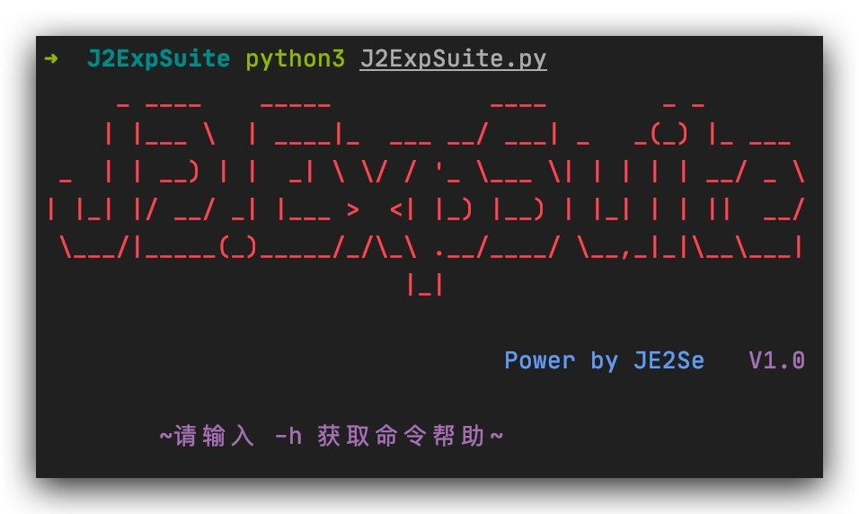
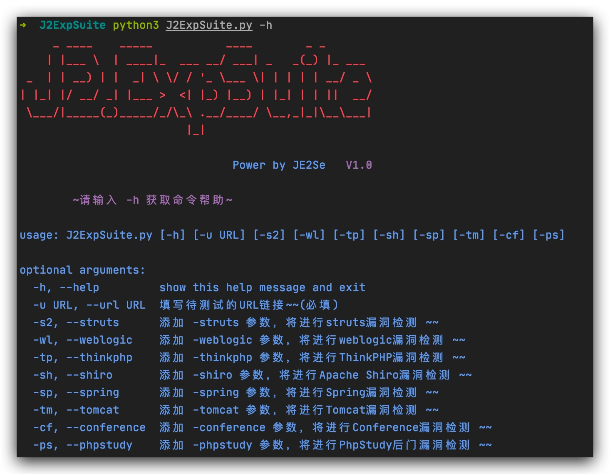
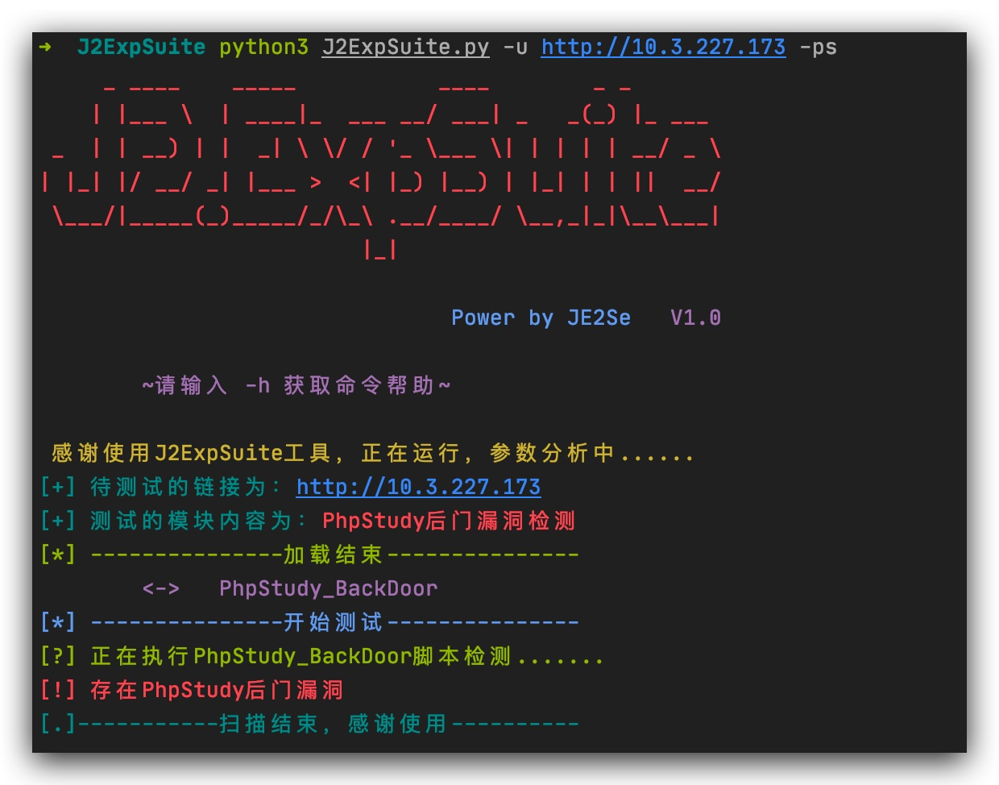

# J2ExpSuite 漏洞检测框架V1.0.1
## 说明
这是一个以python3编写的的漏洞检测框架，可自定义，添加poc，exp，定向检测，初衷是为了什么呢？我想搞一个全面一点的漏洞检测框架，输入一个url，在选择检测漏洞类型，直接出结果，还要满足POC可集成，简单编写就能加载进去。主要是为了快速的检测漏洞高的存在，POC主要类型为RCE，读文件，注入漏洞，文件上传等类型漏洞，主要为了撕口子。于是我花了一天的时间搞出了这个框架，初步的满足了我的想法，指定参数进行漏洞检测。**添加POC，可直接按照POC编写规范，编写后直接放入对应的文件夹内，无需其他操作，可自行加载配置**。

{生活}{POC} orz

先来几个截图看看工具样子
## 版本里程碑
版本 |  更新内容 | 更新时间
-|-|-
V1.0.0|主题框架上传，无POC版|2020年06月1日
V1.0.1|更新部分BUG，简化POC，更新POC编写规范|2020年06月23日

## 脚本展示

### 脚本启动


## 脚本功能菜单（持续更新中）


## 运行截图


选中某个参数后，程序会自动加载目标参数路径下的所有py脚本，加载后会运行，上面的图片是已phpstudy举例的，加载完后会自动进行检测。

## 主题 
老样子，Windows没有皮肤主题，为什么没适配Windows，这是鼓励大家好好的工作，努力赚钱买苹果。

## 目前支持漏洞

框架/组件/中间件 |  漏洞名称 | 更新时间
-|-|-
Phpstudy | Phpstudy后门漏洞 | 2020年06月11日 
  ~|默认口令/空口令 | 2020年06月12日 
  先这样|POC写完了再|一起放上来~


之前写的就先删除了，每天更新一个两个的也没意思，我先自己写

## POC编写规范

### POC格式解析

```python

# encoding: utf-8
from lib import *
import logging
from lib.Urldeal import umethod

def XXX_POC(Url): #必须与脚本名称相同
    scheme, url, port = umethod(Url)
    #------------POC部分，按需更改--------------
    try:
      urldata = scheme + "://" + url + ':' + str(port) + '/login.action'
      if "漏洞判断成功条件":
    #------------POC部分，按需更改--------------
          print(Vcolors.RED +"[!] 存在【漏洞名称】漏洞->版本号:什么漏洞\r" + Vcolors.ENDC)
    except:
        logging.error("【脚本名称】脚本出现异常")
        
```

函数名称需要与脚本名称一致，编写后直接将POC脚本放入对应的路径下就行
### 新增检查项
如新添加OA检测
#### 主文件```J2ExpSuite.py```
在主文件```J2ExpSuite.py```文件中添加索引

```parser.add_argument("-oa", "--oa", help='添加 -oa 参数，将进行OA相关相关漏洞检测  ~~', action='store_true')```

主文件```J2ExpSuite.py```文件中添加执行
 ```python
 if args.oa:
    print(Vcolors.CYAN + "[+] 测试的模块内容为：" + Vcolors.ENDC + Vcolors.RED + "OA相关漏洞检测" + Vcolors.ENDC)
    OAScan(url)
```
#### 目录
在exphub内创建oa目录（建议小写统一规范）内部新建```__init__.py```，以及```OAScan.py```

#### ```OAScan.py```

先看代码

```python
from lib.ModelLoad import ONLoad
from lib import *
import os
import logging

dlist = []
#文件遍历
def OAScan(url):  #函数名与文件名相同，建议为大写字母加上Scan
    for file in os.listdir("./exphub/oa/"):  #修改此处为路径名称，建议为小写
        if os.path.splitext(file)[1] == '.py':
            if os.path.join(file) != "__init__.py" and os.path.join(file) != "OAScan.py":     #排除init文件以及主扫描文件OAScan.py文件
                dlist.append(os.path.join(os.path.splitext(file)[0]))
    ONLoad(dlist)
    try:
        for defclass in dlist:
            print(Vcolors.OKGREEN + "[?] 正在执行" + defclass + "脚本检测.......\r" + Vcolors.ENDC)
            exec("from exphub.oa.{0} import {1}".format(defclass, defclass))   #此处修改导入的exphub.路径信息
            defclass += "(url)"
            exec(defclass)
    except:
        logging.error("OAScan脚本出现异常")  #修改异常监控名称
```

#### ```__init__.py```OA路径

```python
from exphub.oa.OAScan import OAScan  #导入文件名称，导入函数名称
```
#### ```__init__.py```exphub路径

```python
from exphub.oa import *  #导入函数名称
```

## 注意

没有放pip依赖列表，随运行，随安装吧~（没错，我是真的懒）

## 项目地址

项目地址：https://github.com/JE2Se/J2ExpSuite

我还想白嫖几个star，说不定哪天我更新POC呢~

## 项目愿景
二期：

后期会加入到指纹识别

会加入差不多的POC

# 共同维护
大家如果有什么好的POC也可以编写玩发送给我，我们共同与维护这个项目

# 项目支持

感谢|以下|人员|对本|程序|的贡|献。
-|-|-|-|-|-|-
子杰|junsec|Seek
